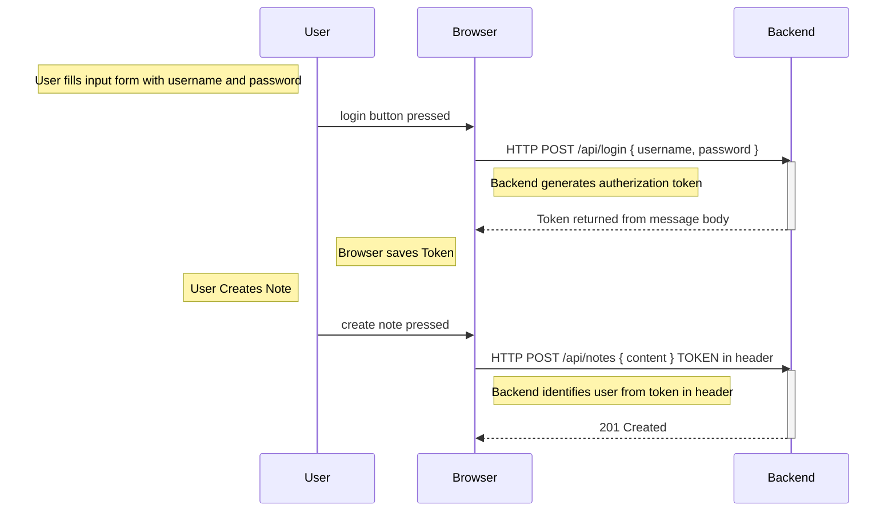

```mermaid

sequenceDiagram
    participant User
    participant Browser
    participant Backend

    Note left of User: User fills input form with username and password
    User->>Browser: login button pressed

    Browser->>Backend: HTTP POST /api/login { username, password }
    activate Backend

    Note right of Browser: Backend generates autherization token

    Backend-->>Browser: Token returned from message body
    deactivate Backend

    Note left of Browser: Browser saves Token

    Note left of User: User Creates Note

    User->>Browser: create note pressed

    Browser->>Backend: HTTP POST /api/notes { content } TOKEN in header
    activate Backend

    Note right of Browser: Backend identifies user from token in header

    Backend-->>Browser: 201 Created
    deactivate Backend

```