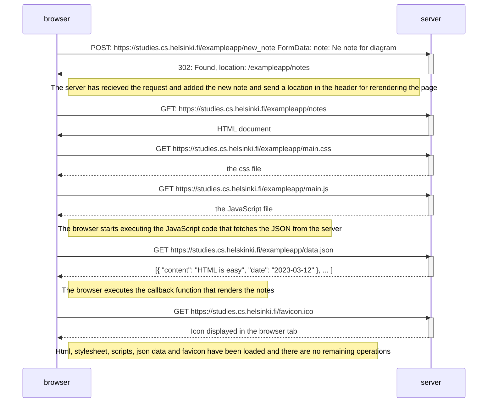

<!--
@author Kiril Mishevski
@desc Diagram representing creating of a new note
@since 3/12/2023
-->

```mermaid
sequenceDiagram
    participant browser
    participant server

    browser->>server: POST: https://studies.cs.helsinki.fi/exampleapp/new_note FormData: note: Ne note for diagram
    activate server
    server-->>browser: 302: Found, location: /exampleapp/notes
    deactivate server

    Note right of browser: The server has recieved the request and added the new note and send a location in the header for rerendering the page

    browser->>server: GET: https://studies.cs.helsinki.fi/exampleapp/notes
    activate server
    server->>browser: HTML document
    deactivate server

        browser->>server: GET https://studies.cs.helsinki.fi/exampleapp/main.css
    activate server
    server-->>browser: the css file
    deactivate server

    browser->>server: GET https://studies.cs.helsinki.fi/exampleapp/main.js
    activate server
    server-->>browser: the JavaScript file
    deactivate server

    Note right of browser: The browser starts executing the JavaScript code that fetches the JSON from the server

    browser->>server: GET https://studies.cs.helskinki.fi/exampleapp/data.json
    activate server
    server-->>browser: [{ "content": "HTML is easy", "date": "2023-03-12" }, ... ]
    deactivate server

    Note right of browser: The browser executes the callback function that renders the notes

    browser->>server: GET https://studies.cs.helsinki.fi/favicon.ico
    activate server
    server-->>browser: Icon displayed in the browser tab
    deactivate server

    Note right of browser: Html, stylesheet, scripts, json data and favicon have been loaded and there are no remaining operations

```