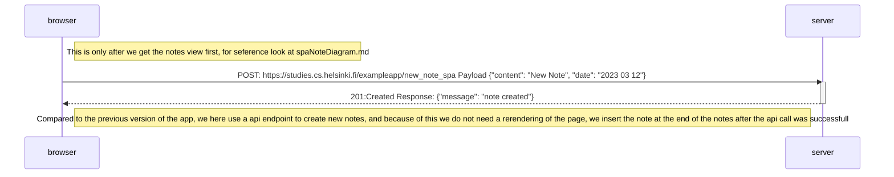

<!--
@author Kiril Mishevski
@desc Diagram representing the flow of creating a new note in the Singla page app version of the notes app
@since 3/12/2023
-->

```mermaid
sequenceDiagram
    participant browser
    participant server

    Note right of browser: This is only after we get the notes view first, for seference look at spaNoteDiagram.md

    browser->>server: POST:  https://studies.cs.helsinki.fi/exampleapp/new_note_spa Payload {"content": "New Note", "date": "2023 03 12"}
    activate server
    server-->>browser: 201:Created Response: {"message": "note created"}
    deactivate server

    Note right of browser: Compared to the previous version of the app, we here use a api endpoint to create new notes, and because of this we do not need a rerendering of the page, we insert the note at the end of the notes after the api call was successfull
```