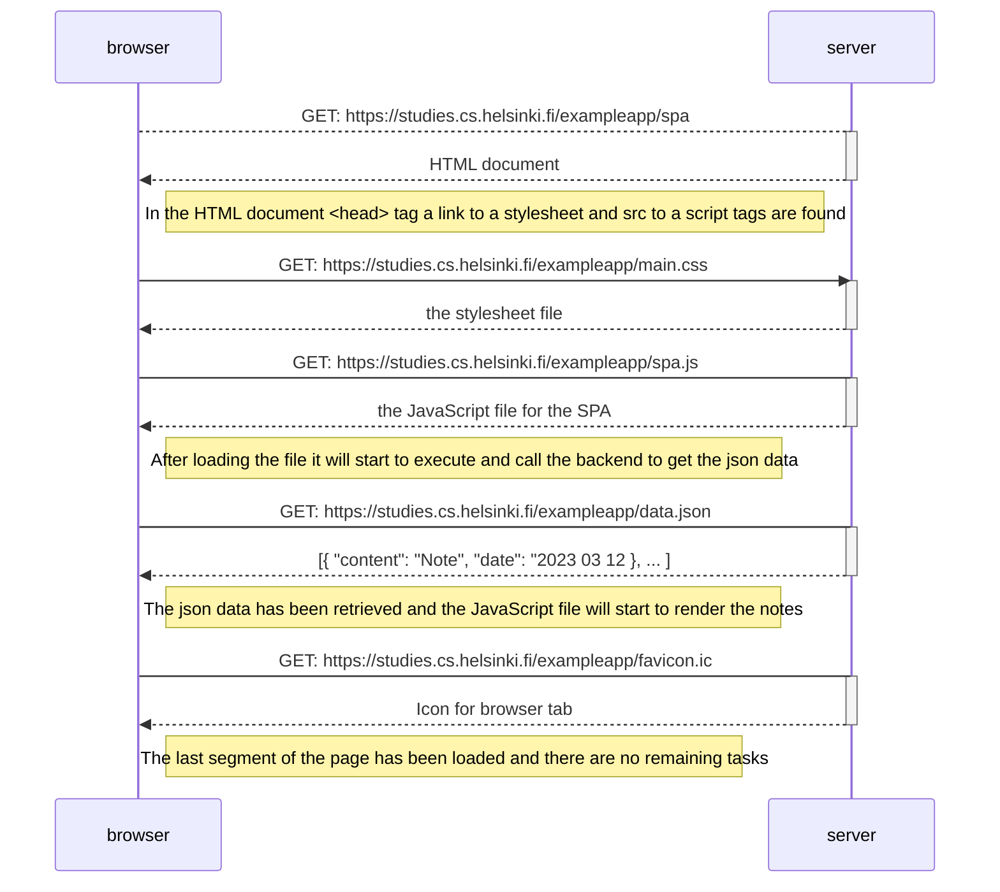

<!--
@author Kiril Mishevski
@desc Notes Diagram to display the flow of the notes Single Page app
@since 3/12/2023
-->

```mermaid
sequenceDiagram
    participant browser
    participant server

    browser-->server: GET:  https://studies.cs.helsinki.fi/exampleapp/spa
    activate server
    server-->>browser: HTML document
    deactivate server

    Note right of browser: In the HTML document <head> tag a link to a stylesheet and src to a script tags are found

    browser->>server: GET: https://studies.cs.helsinki.fi/exampleapp/main.css
    activate server
    server-->>browser: the stylesheet file
    deactivate server

    browser->server: GET: https://studies.cs.helsinki.fi/exampleapp/spa.js
    activate server
    server-->>browser: the JavaScript file for the SPA 
    deactivate server

    Note right of browser: After loading the file it will start to execute and call the backend to get the json data

    browser->server: GET: https://studies.cs.helsinki.fi/exampleapp/data.json
    activate server
    server-->>browser: [{ "content": "Note", "date": "2023 03 12 }, ... ]
    deactivate server

    Note right of browser: The json data has been retrieved and the JavaScript file will start to render the notes

    browser->server: GET: https://studies.cs.helsinki.fi/exampleapp/favicon.ic
    activate server
    server-->>browser: Icon for browser tab
    deactivate server

    Note right of browser: The last segment of the page has been loaded and there are no remaining tasks
```